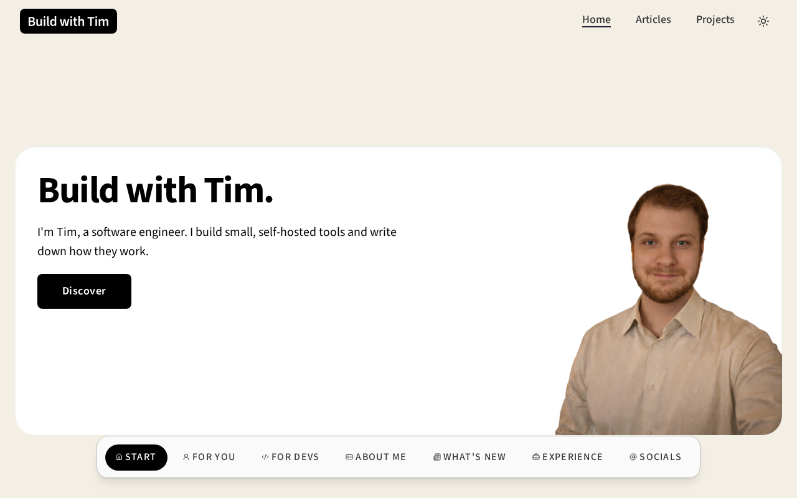
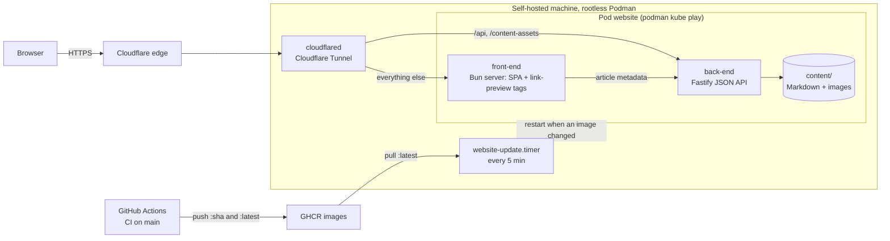

<div align="center">


# Build with Tim

**Build with Tim.**

I'm Tim, a software engineer. I build small, self-hosted tools and write down how they work.

[Live site](https://buildwithtim.dev) · [Articles](https://buildwithtim.dev/articles) · [Projects](https://buildwithtim.dev/projects)

[](https://github.com/Tim-van-Oudheusden/website/actions/workflows/ci.yml)
[](https://github.com/Tim-van-Oudheusden/website/actions/workflows/coverage-gate.yml)
[](LICENSE)
[](https://buildwithtim.dev)
[](https://github.com/Tim-van-Oudheusden/website/commits/main)

</div>

<picture>
  <source media="(prefers-color-scheme: dark)" srcset="docs/assets/readme/home-dark.png">
  
</picture>

## About

Build with Tim is Tim van Oudheusden's site for the things he builds and the write-ups that explain them: open-source
projects, Linux on the desktop, the tools that make his work easier, and the occasional personal reflection. This
repository is the whole site: the React front-end, the Fastify API that serves the Markdown in `content/`, and the
Podman deployment that runs it on a single self-hosted machine.

## Tech stack

- **Front-end:** React 19, Vite, Tailwind CSS 4 with shadcn/ui and Radix, react-markdown
- **Back-end:** Fastify (helmet, rate-limit)
- **Workspace:** Bun workspaces (`front-end`, `back-end`, `shared`) and TypeScript
- **Testing:** Playwright for end-to-end tests, `bun test` for unit tests
- **Infrastructure:** Podman (`kube play`), Cloudflare Tunnel, GitHub Container Registry (GHCR)

## Architecture



cloudflared reaches the pod over loopback only, so the host opens no inbound ports. CI publishes images only after
its checks, E2E and prod-asset jobs pass on `main`. The server setup, rollback and secret handling are in
[`docs/deploy.md`](docs/deploy.md).

## Quick start

Prerequisites: [Podman](https://podman.io/) and [Bun](https://bun.sh/) 1.3.14 (the version CI pins).

```bash
git clone https://github.com/Tim-van-Oudheusden/website.git
cd website
bun install
scripts/dev.sh        # build the dev images, start the pod, follow its logs
scripts/dev-down.sh   # tear the dev pod down
```

The dev pod publishes:

- Front-end (Vite dev server, HMR): <http://localhost:5173>
- Back-end (Fastify): <http://localhost:3001>, with `/health` at the root

The host source is bind-mounted, so edits hot-reload without a rebuild.

### Back-end environment variables

The back-end reads four variables. None is required.

| Variable | Default | Effect |
| --- | --- | --- |
| `HOST` | `127.0.0.1` | Listen address. Running on the host needs no override; in containers (`podman kube play` / `podman run`) set `HOST=0.0.0.0` so published ports and peer containers can reach the API. The dev and prod manifests and the Dockerfile already do. |
| `PORT` | `3001` | Listen port. A value that is not an integer from 1 to 65535 is ignored. The Vite dev proxy always targets port 3001, so the front-end dev server stops reaching a back-end moved elsewhere. |
| `LOG_LEVEL` | `info` | Fastify log level: `trace`, `debug`, `info`, `warn`, `error`, `fatal` or `silent`. |
| `CONTENT_DIR` | the repository's `content/` | Folder of articles and projects to serve. |

`NODE_ENV=production` also hides drafts; see the `draft` field in
[`docs/content-authoring.md`](docs/content-authoring.md).

## Scripts

| Command | What it does |
| --- | --- |
| `bun run dev` | Front-end and back-end dev servers on the host, without containers |
| `bun run dev:front-end` / `bun run dev:back-end` | One dev server on the host |
| `bun run test` | Unit tests in every workspace |
| `bun run typecheck` | TypeScript across `shared`, both apps and the root scripts |
| `bun run typecheck:root` | TypeScript for `playwright.config.ts`, `scripts/` and `e2e/` only |
| `bun run lint` / `bun run lint:fix` | ESLint with zero warnings allowed / apply every autofix |
| `bun run build` | Production builds of both apps |
| `bun run test:e2e` / `bun run test:e2e:headed` | Playwright E2E suite against a running dev pod (headless / headed) |
| `scripts/e2e.sh` | The CI E2E job locally: build, start the pod, run the suite, tear down |
| `bun run screenshots:readme` | Regenerate the README screenshots and social preview from the dev pod |

[`docs/testing.md`](docs/testing.md) covers the E2E prerequisites and the other scripts in `scripts/`.

## Writing content

Articles and projects are Markdown files in `content/`, authored in Obsidian.

> [!WARNING]
> A file with invalid frontmatter is silently left out of the site. Run
> `bun run --filter back-end validate:content` before pushing.

The Obsidian settings, image syntax, frontmatter reference and link previews are described in
[`docs/content-authoring.md`](docs/content-authoring.md).

## Documentation

| Document | Covers |
| --- | --- |
| [`docs/content-authoring.md`](docs/content-authoring.md) | Writing articles and projects: Obsidian, frontmatter, the content check |
| [`docs/testing.md`](docs/testing.md) | Unit and E2E tests, quality reports, the prod-asset check |
| [`docs/deploy.md`](docs/deploy.md) | Server runbook: pod, Cloudflare Tunnel, update timer, rollback |
| [`docs/risk-tiers.md`](docs/risk-tiers.md) | How pull requests are classified by risk |
| [`docs/metrics/README.md`](docs/metrics/README.md) | Quality, coverage and compliance metrics |
| [`docs/security/SECURITY-AI.md`](docs/security/SECURITY-AI.md) | Security model for AI agents in this repo |
| [`BRANDING.md`](BRANDING.md) | Name, voice, colours and typography |

## Contributing

See [`CONTRIBUTING.md`](CONTRIBUTING.md) for the workflow, quality gates and code style.

## Acknowledgments

- [kentcdodds.com](https://kentcdodds.com/), the main inspiration for the home page, blog recommendations and project
  showcase.
- [brittanychiang.com](https://brittanychiang.com/#experience), for the experience timeline.

## Contact

- [GitHub](https://github.com/Tim-van-Oudheusden)
- [LinkedIn](https://www.linkedin.com/in/tim-van-oudheusden)

## License

| Path | License |
| --- | --- |
| Code and everything not listed below | [MIT](LICENSE) |
| `content/` (articles and their images) and `public/images/projects/` | [CC BY 4.0](content/LICENSE) |
| `public/images/me.png` | All rights reserved |
| `public/fonts/` (Source Sans 3) | [SIL Open Font License 1.1](public/fonts/OFL.txt) |
