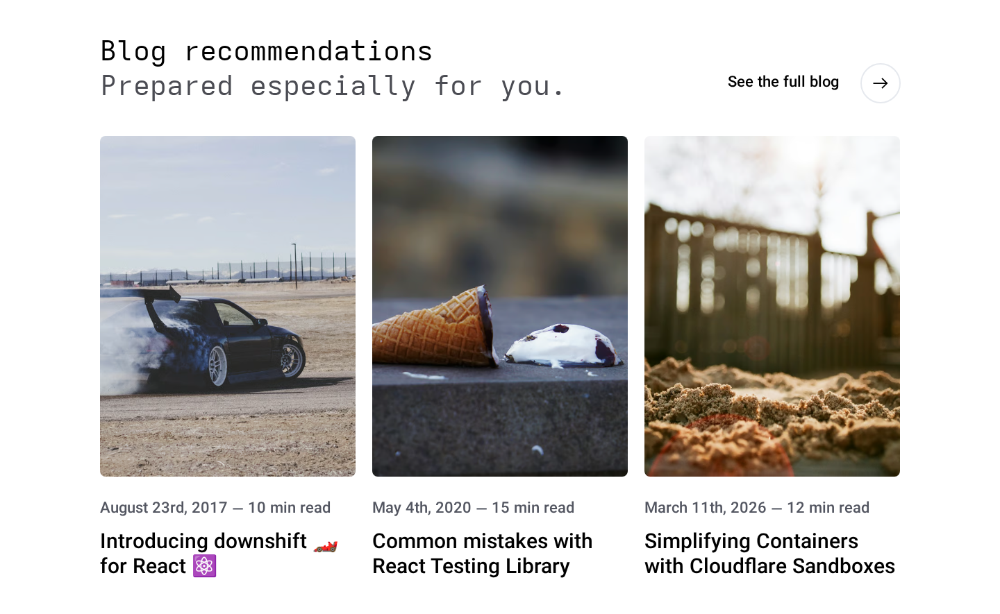
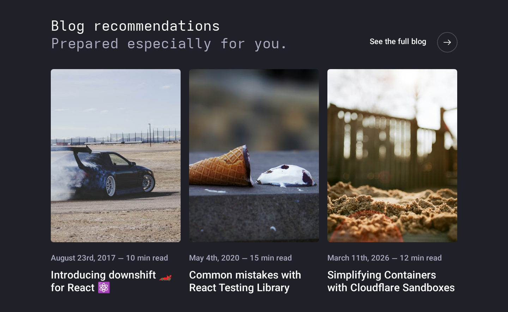
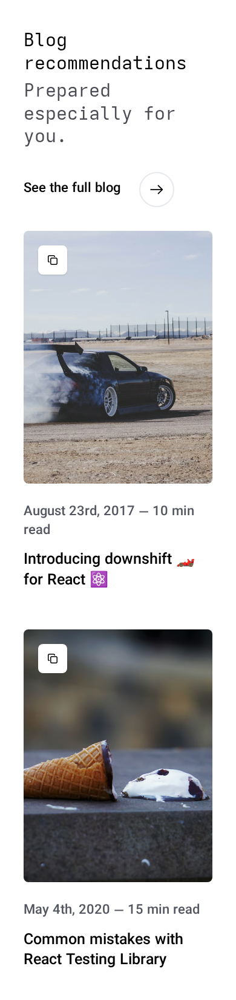
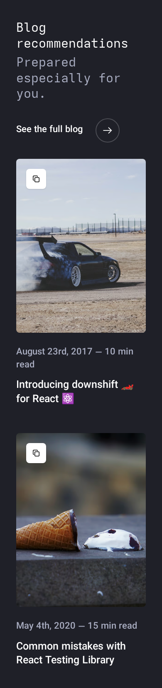
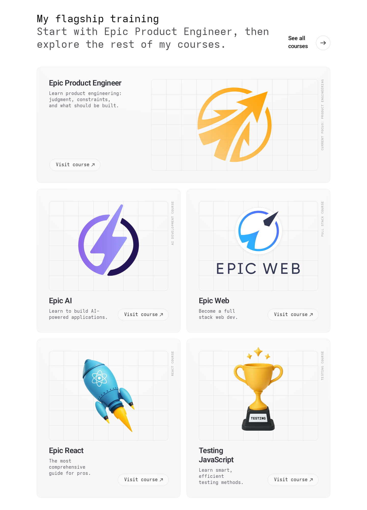
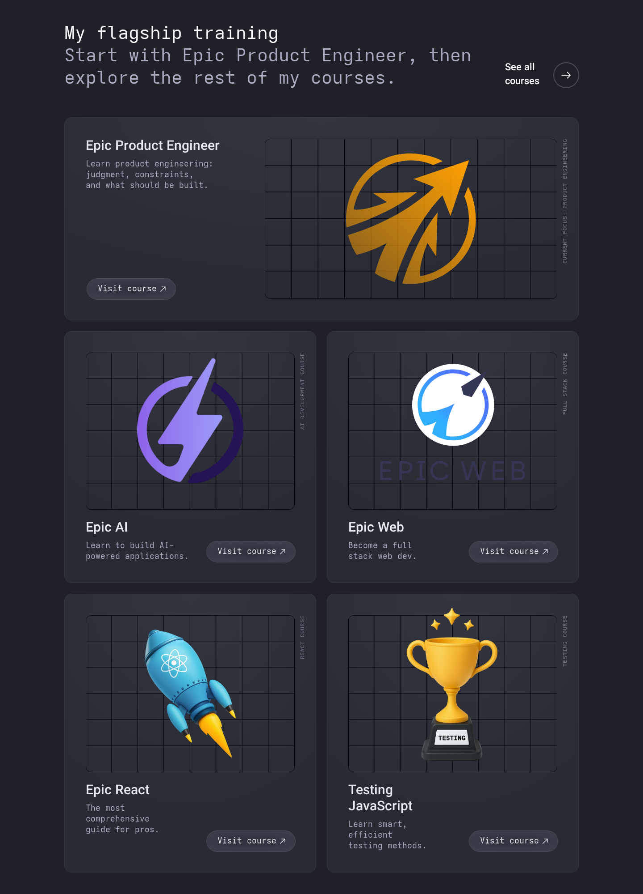
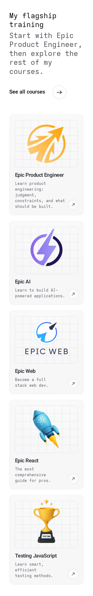
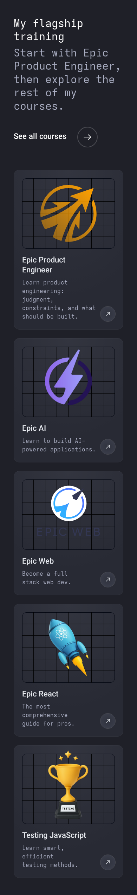

# kentcdodds.com — "Blog recommendations" & "My flagship training" (home page)

Source: <https://kentcdodds.com/> (home page), inspected 2026-10-07 in headless Chromium (chrome-headless-shell 1234) at 1440 / 1024 / 768 / 390 px viewports, light and dark theme (theme toggled by swapping the `light`/`dark` class on `<html>`, which is how the site's CSS is keyed: `.light` / `.dark` selectors + `CH-prefers-color-scheme` cookie).

All numbers below are `getComputedStyle` / `getBoundingClientRect` readings unless marked `[INFERENCE]`. Reference colours are recorded **as reference only** — do not port them; map to `--adw-*` tokens (see last section).

> **Font caveat.** Every text element computes to `font-family: ui-sans-serif, system-ui, sans-serif, "Apple Color Emoji", …` and `document.fonts` is empty — the site ships **no web font**; it uses the OS system UI font. In the screenshots, the 400-weight headings/descriptions render in a monospace face: that is a fallback artefact of the headless host's fontconfig, **not** the design. Only the vertical course labels are intentionally monospace (`font-mono`).

## Screenshots

| | Light | Dark |
|---|---|---|
| Blog recs 1440 |  |  |
| Blog recs 390 |  |  |
| Flagship 1440 |  |  |
| Flagship 390 |  |  |

Tablet (light): [blog 1024](assets/kentcdodds/blog-1024-light.png), [blog 768](assets/kentcdodds/blog-768-light.png), [flagship 1024](assets/kentcdodds/flag-1024-light.png), [flagship 768](assets/kentcdodds/flag-768-light.png).

Interaction states (1440, light): [blog card rest](assets/kentcdodds/blog-card-rest-1440.png), [blog card hover](assets/kentcdodds/blog-card-hover-1440.png), [copy button hover](assets/kentcdodds/blog-copy-button-hover-1440.png), [blog card keyboard focus](assets/kentcdodds/blog-card-focus-1440.png), ["See the full blog" rest](assets/kentcdodds/see-full-blog-rest-1440.png) / [hover](assets/kentcdodds/see-full-blog-hover-1440.png), [course card "Visit course" hover](assets/kentcdodds/flag-card-button-hover-1440.png).

---

## 0. Site layout primitives both sections use

Breakpoints (from the stylesheet's media queries): `sm` 480px, `md` 640px, `lg` 1024px, `xl` 1500px. Container-query sizes in use: `@xs` 20rem, `@sm` 24rem, `@lg` 32rem, `@2xl` 42rem, `@3xl` 48rem, `@6xl` 72rem.

Every section is two stacked wrappers, siblings directly under `<main>` (no `<section>` element, no landmark):

```
<div class="relative mx-10vw">                      ← margin-inline: 10vw
  <div class="relative grid grid-cols-4 gap-x-4      ← 4 cols, 16px gap
              md:grid-cols-8                         ← 8 cols ≥640
              lg:grid-cols-12 lg:gap-x-6             ← 12 cols, 24px gap ≥1024
              mx-auto max-w-7xl">                    ← max-width 1280px
```

| Viewport | Side margin (10vw) | Content width | Grid columns | Column gap |
|---|---|---|---|---|
| 390 | 39px | 312px | 4 | 16px |
| 768 | 76.8px | 614.4px | 8 | 16px |
| 1024 | 102.4px | 819.2px | 12 | 24px |
| 1440 | 144px | 1152px | 12 | 24px |
| ≥1600 | — | 1280px (capped) | 12 | 24px |

Vertical rhythm between pieces is done with **empty spacer divs** rather than margins: `h-10 lg:h-12` (40/48px) between heading and cards in Blog recs; `h-56 lg:h-64` (224/256px) between the end of Blog recs and the start of Flagship. Flagship's heading row instead uses `mb-16` (64px).

---

## 1. Shared section-heading pattern

### Anatomy

```
┌──────────────────────────── col-span-full ───────────────────────────────┐
│ ┌─ div.space-y-2 (lg:space-y-0) ─────────┐            ┌─ <a> ──────────┐ │
│ │ <h2>  Blog recommendations             │            │ See the full   │ │
│ │ <p>   Prepared especially for you.     │            │ blog   (→ ◯)   │ │
│ └────────────────────────────────────────┘            └────────────────┘ │
└──────────────────────────────────────────────────────────────────────────┘
  < lg : flex-col, space-y-10 (40px) between text block and link, link left-aligned
  ≥ lg : flex-row, items-end, justify-between (link bottom-right, baseline-ish with subheading)
```

Markup (verbatim classes):

```html
<div class="col-span-full flex flex-col space-y-10 lg:flex-row lg:items-end lg:justify-between lg:space-y-0">
  <div class="space-y-2 lg:space-y-0">
    <h2 class="leading-tight text-3xl md:text-4xl text-black dark:text-white">Blog recommendations</h2>
    <p  class="leading-tight text-3xl md:text-4xl text-gray-600 dark:text-slate-500">Prepared especially for you.</p>
  </div>
  <a class="text-primary inline-flex cursor-pointer items-center text-left font-medium transition focus:outline-none" href="/blog">
    <span class="mr-8 text-xl font-medium">See the full blog</span>
    <div class="relative inline-flex h-14 w-14 flex-none items-center justify-center p-1">
      <div class="absolute text-gray-200 dark:text-gray-600">
        <svg width="60" height="60">
          <circle stroke="currentColor" stroke-width="2" fill="transparent" r="28" cx="30" cy="30"/>          <!-- track -->
          <circle class="text-primary" stroke="currentColor" stroke-width="2" fill="transparent" r="28" cx="30" cy="30"
                  style="stroke-dasharray:175.93 175.93; transform:rotate(-90deg); transform-origin:50% 50%; transform-box:fill-box"
                  stroke-dashoffset="175.93"/>                                                            <!-- progress ring -->
        </svg>
      </div>
      <span><svg class="-rotate-90" width="32" height="32" viewBox="0 0 32 32"><!-- down-arrow path rotated → right arrow --></svg></span>
    </div>
  </a>
</div>
```

Flagship uses the identical component with `mb-16` appended to the row, subheading "Start with Epic Product Engineer, then explore the rest of my courses." and link text "See all courses" → `/courses`.

### Measurements

| Element | 390 | 768 | 1024 | 1440 |
|---|---|---|---|---|
| `h2` font-size / line-height / weight | 30px / 37.5px / 400 | 40px / 50px / 400 | 40px / 50px / 400 | 40px / 50px / 400 |
| `p` subheading size / lh / weight | 30 / 37.5 / 400 | 40 / 50 / 400 | 40 / 50 / 400 | 40 / 50 / 400 |
| Gap h2 → p | 8px (`space-y-2`) | 8px | 0 | 0 |
| Gap text block → link | 40px (`space-y-10`), stacked | 40px, stacked | side by side | side by side |
| Link label | 22px / 30.8px / 500 | same | same | same |
| Label → circle gap | 32px (`mr-8`) | same | same | same |
| Circle button | 56×56 (`h-14 w-14 p-1`), SVG 60×60, r=28, stroke 2 | same | same | same |
| Arrow icon | 32×32 | same | same | same |
| Link box width (1440) | — | — | 220.8px ("See the full blog") | 248px |

Notes:
- Heading and subheading are **the same size and weight** (400, `leading-tight` = 1.25); the only differentiation is colour. Letter-spacing normal.
- At 1024/1440 "See all courses" wraps to two lines because the long subheading squeezes the link (visible in the flagship screenshots). The subheading in Flagship is 2 lines at 1440 (987px wide).
- Colours (reference only): h2 `#000` / dark `#fff`; subheading `gray-600 #4b4c53` / dark `slate-500 #a9adc1`; link text `text-primary` = `#000` / `#fff`; ring track `gray-200 #e6e9ee` / dark `gray-600 #4b4c53`; progress ring `text-primary`.

### Interaction (link)

| State | Observed |
|---|---|
| Rest | Track ring visible (light grey), progress ring `stroke-dashoffset: 175.93` (invisible). Arrow `transform: none`. |
| Hover | Progress ring animates `stroke-dashoffset 175.93 → 0` (full circle draws clockwise from 12 o'clock, because of `rotate(-90deg)`), arrow nudges `translateX(4px)`. Animated via framer-motion inline styles (JS), not CSS `:hover`. Text colour unchanged. ([rest](assets/kentcdodds/see-full-blog-rest-1440.png) → [hover](assets/kentcdodds/see-full-blog-hover-1440.png)) |
| Focus | `focus:outline-none` on the `<a>`; [INFERENCE] the same framer "active" animation is triggered on focus (not verified). |
| Transition | CSS `transition` (150ms `cubic-bezier(.4,0,.2,1)`) for colour props; the ring/arrow timing comes from framer-motion and was not measured. |

---

## 2. Blog recommendations

### Anatomy

```
<main>
 ├─ div.mx-10vw > grid             ← heading row (section 1 pattern)
 ├─ div.h-10.lg:h-12               ← spacer 40 / 48px
 ├─ div.mx-10vw > div.grid (4/8/12 cols, gap-x 16/24, gap-y-16 = 64px)
 │    ├─ div.col-span-4                ┐
 │    ├─ div.col-span-4                ├─ 3 article cards
 │    └─ div.col-span-4.hidden.lg:block┘  (3rd card only ≥1024)
 └─ div.h-56.lg:h-64               ← spacer 224 / 256px before next section

Card (div.col-span-4 > div.relative.w-full):
 ┌───────────────────────────────┐
 │ <a.group.peer block>          │
 │ ┌───────────────────────────┐ │
 │ │ [copy-url button]  ← abs. │ │  ← button is a SIBLING of <a>, absolutely
 │ │                           │ │     positioned top-6 left-6 over the image
 │ │    aspect 3/4,       │ │
 │ │   object-cover, r=8px     │ │
 │ └───────────────────────────┘ │
 │  mt-8  August 23rd, 2017 — 10 min read   (date · read time, muted)
 │  mt-4  Introducing downshift 🏎 for React ⚛️ (title, div – not a heading)
 └───────────────────────────────┘
```

- **Grid, not a carousel.** No horizontal scrolling at any width.
- Title/date/read-time sit **below** the image. **No gradient, no overlay, no text on the image.**
- The image is the **article's banner/hero image** (Unsplash photo served through the site's `/media/…` Cloudinary-style transform: `w_955,h_1273,fit_cover,bg_e6e9ee` → 3:4 crop). Verified: the `/blog/colocation` card's photo id appears 28× in that article's HTML. It is **not** the `og:image` (that is a generated `/resources/og-image?tpl=social-preview…`).
- Image attrs: `srcset` 280w/560w/840w/1100w/1300w/1650w (all 3:4), `sizes="(max-width:639px) 80vw, (min-width:640px) and (max-width:1023px) 40vw, (min-width:1024px) and (max-width:1620px) 25vw, 420px"`, `loading="lazy"`, `crossorigin="anonymous"`, `title` = post title, `alt` = photo credit string (e.g. `Photo by [Isaac Jenks](https://unsplash.com/…)` — raw markdown). Image starts `opacity-0` and an inline `onload` removes it (fade-in); a `<noscript>` duplicate img exists for no-JS.
- **Randomised per request.** Five consecutive loads returned five different sets (e.g. `introducing-downshift-for-react | common-mistakes-with-react-testing-library | simplifying-containers-with-cloudflare-sandboxes`, then `how-writing-custom-babel… | get-a-catch-block-error-message… | improve-test-error-messages…`, then `please-dont-commit-commented-out-code | useeffect-vs-uselayouteffect | test-isolation-with-react`, …). Selection is server-rendered (cards are in the SSR HTML), so it changes on every page load, not client-side after hydration. [INFERENCE] the pool is a curated/popular subset of posts; very old (2017) and new (2026) posts both appear.

### Measurements

| Item | 390 | 768 | 1024 | 1440 |
|---|---|---|---|---|
| Cards visible | 2 (3rd `hidden`) | 2 | 3 | 3 |
| Cards per row | 1 (span 4 of 4) | 2 (span 4 of 8) | 3 (span 4 of 12) | 3 |
| Card width | 312 | 299.2 | 257.1 | 368 |
| Image box (w×h) | 312×416 | 299.2×398.9 | 257.1×342.8 | 368×490.7 |
| Image aspect / radius | 3:4 / 8px (`rounded-lg`) | same | same | same |
| `object-fit` / position | cover / 50% 50% | same | same | same |
| Row gap (stacked cards) | 64px (`gap-y-16`) | n/a (1 row) | n/a | n/a |
| Column gap | 16px | 16px | 24px | 24px |
| Image → date gap | 32px (`mt-8`) | 32 | 32 | 32 |
| Date font | 22px / 30.8px / 500 | same | same | same |
| Date → title gap | 16px (`mt-4`) | 16 | 16 | 16 |
| Title font | 25px / 33.33px / 500 (`text-2xl`) | 30px / 36px / 500 (`md:text-3xl`) | 30 / 36 / 500 | 30 / 36 / 500 |
| Card total height | 592.3 | 585.7 | 596.4 | 641.5 |
| Heading → grid spacer | 40px | 40px | 48px | 48px |

Text format: `{Month} {ordinal day}, {year} — {n} min read` (em dash with spaces). Titles wrap freely (no line clamp); emoji retained.

Colours (reference only): date `text-secondary` = `gray-500 #535661` / dark `slate-500 #a9adc1`; title `#000` / `#fff`; page bg `#fff` / dark `gray-900 #1f2028`; image placeholder bg `#e6e9ee` (baked into the transform URL).

### Copy-URL button

```html
<button class="ring-team-current rounded-lg bg-white p-3 text-lg font-medium whitespace-nowrap text-black shadow transition
               group-hover:opacity-100 peer-hover:opacity-100 peer-focus:opacity-100 hover:opacity-100
               hover:shadow-md hover:ring-4 focus:opacity-100 focus:ring-4 focus:outline-none
               lg:px-8 lg:py-4 lg:opacity-0 absolute top-6 left-6 z-10">
  <span class="sr-only lg:not-sr-only lg:inline">Click to copy url</span>
  <span class="inline lg:sr-only"><svg 24×24 two-overlapping-rounded-squares "copy" icon/></span>
</button>
```

| | < 1024 | ≥ 1024 |
|---|---|---|
| Content | 24px copy icon (label is `sr-only`) | Text "Click to copy url" (icon is `sr-only`) |
| Size | 48×48 (`p-3`) | 194×60 (`px-8 py-4`), 18px / 500 |
| Visibility | always visible (opacity 1) | `opacity: 0` until card hover/focus or own hover/focus |
| Position | `top: 24px; left: 24px`, z-10, over image top-left | same |
| Style | white bg, black text, 8px radius, `shadow` (`0 1px 3px rgb(0 0 0/.1), 0 1px 2px -1px rgb(0 0 0/.1)`) | same |
| Hover | `shadow-md` + 4px ring in `--color-team-current` (black for anonymous visitors; team colour—blue/red/yellow—if logged in) | same ([screenshot](assets/kentcdodds/blog-copy-button-hover-1440.png)) |
| Click | Copies the absolute post URL (`https://kentcdodds.com/blog/colocation`) to clipboard; label changes to **"Copied to clipboard"** and reverts to "Click to copy url" within ~2.8s (observed) | same |

The `peer` trick: `<a class="group peer">` precedes the button, so `peer-hover` / `peer-focus` on the link reveal the button.

### Card interaction states

| State | Observed (1440, light) |
|---|---|
| Rest | Plain image, no shadow. Copy button hidden (≥lg). |
| Hover (anywhere on `<a>`) | **Ring around the image only**: `.focus-ring` utility → `box-shadow: 0 0 0 4px #fff (offset), 0 0 0 6px var(--color-team-current)` i.e. 2px black ring with a 4px white gap, following the 8px radius. Copy button fades in. **No zoom/scale, no overlay, no title colour change, no lift.** ([hover](assets/kentcdodds/blog-card-hover-1440.png)) |
| Keyboard focus on `<a>` | Same ring as hover (via `.focus-ring:is(.group:focus *)`), `outline: none`, copy button visible. ([focus](assets/kentcdodds/blog-card-focus-1440.png)) |
| Dark mode ring | offset colour switches to `gray-900` (page bg) so the gap blends into the page. |
| Transitions | `transition` utility on img; computed `transition-duration: 0.3s` on the image (opacity fade + ring); button 150ms default easing `cubic-bezier(.4,0,.2,1)`. |
| Hover gating | All hover rules are wrapped in `@media (hover: hover)` (Tailwind v4 default) — touch devices never get hover styles, which is why the button is permanently visible < lg. |

---

## 3. My flagship training

### Anatomy

```
heading row (section 1 pattern, + mb-16 = 64px)
div.mx-10vw > div.grid  @container/grid  grid-cols-12!  gap-6 (24px)  xl:gap-8 (32px ≥1500)
 ├─ wrapper.@container.col-span-full                       ← FEATURED: Epic Product Engineer
 └─ wrapper.@container.col-span-full.@2xl:col-span-6  ×4   ← Epic AI, Epic Web, Epic React, Testing JavaScript
```

Column switching is driven by a **container query on the grid** (`@2xl` = grid ≥ 42rem/672px), not the viewport:

| Viewport | Grid width | Layout |
|---|---|---|
| 390 | 312 | 1 column, all 5 cards stacked; featured card looks like the others |
| 768 | 614.4 | 1 column (grid < 672px) |
| 1024 | 819.2 | featured full-width in **row** layout (media right); 2×2 grid of smaller cards |
| 1440 | 1152 | same as 1024, larger padding/type (grid ≥ 72rem → `@6xl/grid` variants) |

Fixed order (did not change across 5 reloads): Epic Product Engineer, Epic AI, Epic Web, Epic React, Testing JavaScript.

### Card anatomy

```
Standard card (flex-col)                      Featured card at @2xl (flex-row)
┌───────────────────────────────────┐ ┌──────────────────────────────────────────────────────┐
│ ┌─ media box (aspect 4/3) ──────┐ L│ │ Title                    ┌─ media (62% w, 11/6) ──┐ L│
│ │ grid-line SVG background      │ A│ │ Description              │ grid-line SVG          │ A│
│ │        [ course logo ]        │ B│ │                          │   [ course logo ]      │ B│
│ └───────────────────────────────┘ E│ │                          │                        │ E│
│ Title                    (↗ btn) L│ │ (Visit course ↗)         └────────────────────────┘ L│
│ Description                       │ └──────────────────────────────────────────────────────┘
└───────────────────────────────────┘   LABEL = vertical mono caption rotated -90°, right of media
```

Markup (classes verbatim, standard card):

```html
<div class="@container col-span-full @2xl:col-span-6">
  <div class="course-card-gradient dark:bg-gray-850 relative flex h-full gap-5 overflow-hidden rounded-2xl bg-gray-100 p-6
              ring-1 ring-[rgba(0,0,0,0.05)] ring-inset @sm:gap-6 @sm:p-9 @2xl/grid:gap-6 @2xl/grid:p-9 @6xl/grid:p-12
              dark:ring-[rgba(255,255,255,0.05)] flex-col">            <!-- featured adds @2xl:flex-row -->
    <div class="relative">                                              <!-- featured: w-full @2xl:order-last @2xl:w-[62%] -->
      <div class="absolute top-0 right-0 hidden origin-bottom-right translate-x-5 -translate-y-full -rotate-90 text-right
                  font-mono text-[11px]/none tracking-widest text-gray-400 uppercase opacity-80 @sm:block @2xl/grid:block
                  @6xl/grid:translate-x-6 @6xl/grid:text-xs/none dark:text-slate-500 dark:opacity-60">AI development course</div>
      <div class="flex aspect-4/3 items-center justify-center rounded-xl border border-gray-300 dark:border-gray-950">  <!-- featured: @2xl:aspect-11/6 -->
           <!-- heights vary per logo: 70% / 80% / 82% -->
        <svg viewBox="0 0 440 240" class="pointer-events-none absolute z-0 hidden h-full w-full text-gray-300 dark:text-black">  <!-- 11×6 grid, wide variant -->
        <svg viewBox="0 0 320 240" class="pointer-events-none absolute z-0 h-full w-full text-gray-300 dark:text-black">          <!-- 8×6 grid, 4:3 variant -->
      </div>
    </div>
    <div class="flex flex-1 items-start gap-2 @xs:gap-4 @sm:gap-8">      <!-- featured: @2xl:flex-col -->
      <div class="flex-1">
        <h2 class="text-xl/7 font-semibold text-balance tracking-tight text-gray-800 @sm:text-2xl/7 @2xl/grid:text-xl/7
                   @3xl/grid:text-2xl/7 @6xl/grid:text-3xl/9 dark:font-medium dark:tracking-normal dark:text-gray-200">Epic AI</h2>
        <p class="mt-2 text-balance text-base/6 text-gray-500 dark:prose-dark @6xl/grid:text-lg/6">Learn to build AI-powered applications.</p>
      </div>
      <a class="course-card-button-gradient inline-flex shrink-0 items-center justify-center gap-0.5 rounded-full border border-gray-300
                bg-gray-100 text-gray-900 transition-all duration-300 hover:border-gray-500 hover:bg-white dark:border-gray-600
                dark:bg-gray-700 dark:text-gray-200 dark:hover:border-slate-500 h-11 w-11 translate-x-0.5 translate-y-0.5 self-end
                @lg:h-12 @lg:w-auto @lg:pr-4 @lg:pl-6" href="https://www.epicai.pro" tabindex="0">
        <span class="shrink-0 -translate-y-px text-base whitespace-nowrap @6xl/grid:text-lg @lg:not-sr-only sr-only">Visit course</span>
        <span><svg class="-rotate-[135deg]" width="24" height="24" viewBox="0 0 32 32"><!-- arrow → ↗ --></svg></span>
      </a>
    </div>
  </div>
</div>
```

Decorative grid SVG: one `<path>` of horizontal + vertical lines every 40 viewBox units, `stroke="currentColor" stroke-width="1" vector-effect="non-scaling-stroke"` (always 1 CSS px). Wide variant 440×240 (11×6 cells) shown when the card is `@2xl`; otherwise 320×240 (8×6 cells). Line colour `gray-300` light / `black` dark.

Gradient utilities (custom CSS, reference):

```css
.course-card-gradient            { background-image: radial-gradient(80% 80% at 50% -10%, rgba(255,255,255,.5), transparent); }
.dark .course-card-gradient      { background-image: radial-gradient(80% 80% at 50% 0, rgba(204,204,204,.3), transparent); background-blend-mode: soft-light; }
.course-card-button-gradient     { background-image: radial-gradient(70% 70%, #fff, transparent); }
.dark .course-card-button-gradient       { background-image: radial-gradient(60% 50%, rgba(11,14,20,.2), transparent); background-blend-mode: overlay; }
.dark .course-card-button-gradient:hover { background-image: radial-gradient(60% 50%, rgba(11,14,20,.5), transparent); background-blend-mode: overlay; }
```

Card content:

| # | Title | Description | Vertical label | Link | Logo alt |
|---|---|---|---|---|---|
| 1 (featured) | Epic Product Engineer | Learn product engineering: judgment, constraints, and what should be built. | Current focus: product engineering | https://www.epicproduct.engineer | The EpicProduct.engineer logo (inline SVG data URI) |
| 2 | Epic AI | Learn to build AI-powered applications. | AI development course | https://www.epicai.pro | The EpicAI.pro logo |
| 3 | Epic Web | Become a full stack web dev. | Full stack course | https://www.epicweb.dev | The EpicWeb.dev logo |
| 4 | Epic React | The most comprehensive guide for pros. | React course | https://epicreact.dev | not captured (3D rocket illustration) |
| 5 | Testing JavaScript | Learn smart, efficient testing methods. | Testing course | https://testingjavascript.com | not captured (3D trophy illustration) |

### Measurements

| Item | 390 | 768 | 1024 | 1440 |
|---|---|---|---|---|
| Grid gap (row & col) | 24px | 24px | 24px | 24px (32px ≥1500) |
| Featured card size | 312×398 | 614.4×610.8 | 819.2×324.7 | 1152×453.1 |
| Featured direction | column | column | **row** (media right, 62% width) | row |
| Featured media box | 264×198 (4:3) | 542.4×406.8 (4:3) | 463.3×252.7 (11:6) | 654.7×357.1 (11:6) |
| Small card size | 312×350 | 614.4×562.8–586.8 | 397.6×424.2 | 564×563 |
| Small media box (4:3) | 264×198 | 542.4×406.8 | 325.6×244.2 | 468×351 |
| Card padding | 24px | 36px | 36px | 48px |
| Card internal gap (media ↔ text) | 20px | 24px | 24px | 24px |
| Card radius / media radius | 16px / 12px | same | same | same |
| Media border | 1px | 1px | 1px | 1px |
| Title | 22px / 28px / 600, `-0.55px` | 25 / 28 / 600, `-0.625px` | 25 / 28 / 600 | 30 / 36 / 600, `-0.75px` |
| Description | 16px / 24px, `mt-2` | 16 / 24 | 16 / 24 | 18 / 24 |
| CTA button | 44×44 icon-only circle | 183.2×48 pill "Visit course ↗" | featured: 183.2×48 pill; small: 44×44 icon | 200×48 pill (label 18px) |
| CTA padding (pill) | — | `0 16px 0 24px` | `0 16px 0 24px` | `0 16px 0 24px` |
| Vertical label | hidden (card < 24rem) | 11px mono, tracking 1.1px | 11px | 12px, tracking 1.2px |
| Equal heights in a row | — | — | yes (`h-full`) | yes |

Pill vs icon-only is per-card: `@lg` = the card's own container ≥ 32rem (512px). At 1024 the small cards (397px) show the 44px circle; at 1440 (564px) they show the full pill.

Colours (reference only):

| Token | Light | Dark |
|---|---|---|
| Card bg | `gray-100 #f7f7f7` + white radial highlight top | `gray-850 #282a34` + soft-light radial |
| Card ring | inset 1px `rgba(0,0,0,.05)` | inset 1px `rgba(255,255,255,.05)` |
| Media border | `gray-300 #dde0e4` | `gray-950 oklch(0.13 0.028 261.7)` |
| Grid lines | `gray-300 #dde0e4` | `#000` |
| Title | `gray-800 #2e3039`, 600, tracking-tight | `gray-200 #e6e9ee`, 500, tracking normal |
| Description | `gray-500 #535661` | `slate-500 #a9adc1` |
| Vertical label | `gray-400 #818890`, opacity .8 | `slate-500 #a9adc1`, opacity .6 |
| CTA rest | bg `gray-100`, border `gray-300`, text `gray-900 #1f2028` | bg `gray-700 #3a3d4a`, border `gray-600 #4b4c53`, text `gray-200` |
| CTA hover | bg `#fff`, border `gray-500 #535661` | border `slate-500` + darker gradient (CSS rule above) |

### Interaction states

| Target | Observed |
|---|---|
| Card body | **No hover effect**: bg, shadow, transform unchanged on hover; `cursor: auto`. The card is not a link — only the CTA is clickable. |
| CTA hover | Border darkens, bg goes white; `transition-all 300ms`. Arrow icon does not move (inline style stayed `transform:none`). ([screenshot](assets/kentcdodds/flag-card-button-hover-1440.png)) |
| CTA focus | No explicit focus classes on the CTA → browser default focus outline [INFERENCE: not screenshotted]. |
| Logo | Static; no hover animation. |

Hover screenshots were taken by injecting the site's own `@media (hover: hover)` rules unconditionally because the headless host reports `hover: none`; the measured values come from those exact rules.

---

## 4. Accessibility notes

- No `<section>`/`aria-labelledby`; sections are anonymous `<div>`s under `<main>`. Both section titles are `<h2>`.
- Course card titles are **also `<h2>`** (flat outline: "My flagship training" and its five cards are siblings). Better: `<h3>` for cards.
- Blog card titles are `<div>`s, not headings, inside one big `<a>`. The link's accessible name concatenates the image alt (a raw-markdown photo credit), the date and the title — noisy for screen readers. Better: `alt=""` on the decorative image (or describe it), and a real heading for the title.
- Copy button: no `type` attribute (not in a form, so harmless), visible text "Click to copy url" ≥lg / sr-only text <lg — always has a name. No `aria-live` on the "Copied to clipboard" change [INFERENCE: not announced].
- All five CTAs share the accessible name "Visit course" (ambiguous out of context); external links have no `target`, no "opens external site" hint.
- Vertical labels are visible text, not `aria-hidden`; their reading order is before the title.
- Focus: `focus:outline-none` on the "See all/full …" links and blog card links; blog cards replace it with the image ring, the heading links rely on framer animation (no static focus indicator verified).
- Hover is gated on `(hover: hover)`, so touch users get the always-visible copy button rather than hidden controls.
- `prefers-reduced-motion` media queries exist in the stylesheet; not verified whether they disable the ring animation.

---

## 5. Adaptation notes for buildwithtim.dev

Installed shadcn components (front-end/src/shared/components/ui/): `button`, `card`, `badge`, `sheet`, `dropdown-menu`, `collapsible`.

| Kent part | Map to | Notes |
|---|---|---|
| Section container (`mx-10vw` + 12-col grid, `max-w-7xl`) | Custom layout wrapper (plain Tailwind) | Keep one `SectionHeading`/`HomeSection` wrapper so both sections share margins; use the project's existing container convention if one exists rather than introducing `10vw`. |
| Section heading (h2 + muted p, same size) | Custom `SectionHeading` component | Title colour → `--adw-window-fg-color` / `text-foreground`; subheading → muted foreground (`--adw-dark-2`/`--adw-light-5`-derived or shadcn `text-muted-foreground`). Same size/weight for both lines; 30→40px at `md`. |
| "See the full blog →" with circular progress ring | `Button` (`variant="link"`/`ghost`, `asChild` + router link) + custom SVG ring | Ring/arrow animation is custom: CSS `stroke-dashoffset` transition on `group-hover`/`group-focus-visible` (175.93 → 0) + `translate-x-1` on the arrow. No framer-motion needed; respect `motion-reduce:`. Ring track → `--adw-light-3` / dark equivalent, progress → `--adw-accent-color`. |
| Blog recommendation grid | Plain CSS grid (1 / 2 / 3 cols; 3rd item `hidden lg:block`) | Not a carousel. If Tim wants randomisation, do it server-side (Fastify) or per request; Kent's set changes on each SSR load. |
| Blog card | `Card` is a poor fit (Kent's card has no surface/border) → custom `ArticleCard`: `<a class="group">` wrapping `aspect-[3/4] rounded-lg object-cover` image + meta + title | Hover/focus = ring around image only (`ring-2 ring-offset-4` with `ring-offset-background`, ring colour `--adw-accent-color`); no zoom. Use a real heading element for the title and `alt=""` for decorative cover. Meta line "Date — N min read" in muted colour. |
| Copy-URL button | `Button` (`variant="secondary"`/`outline`, `size="icon"` < lg, default size ≥ lg) | Absolutely positioned `top-6 left-6`; reveal with `lg:opacity-0 group-hover:opacity-100 group-focus-within:opacity-100`; place it outside the `<a>` (sibling) to avoid nested interactive content; `navigator.clipboard.writeText`, swap label to "Copied to clipboard" for ~2s; add `aria-live="polite"`. Optional toast: `bunx --bun shadcn@latest add sonner` (only if a toast system is wanted — not required). |
| Flagship grid | Plain CSS grid with container queries (Tailwind v4 has `@container` built-in) | Featured item `col-span-full` + `@2xl:flex-row`; others `@2xl:col-span-6`. Container query on the grid keeps cards correct inside narrower layouts. |
| Course card surface | `Card` (installed) | Override radius to `rounded-2xl`, bg → `--adw-view-bg-color`/sidebar-ish neutral, 1px inset ring at 5% fg; optional radial highlight as a utility class. No card-level hover. |
| Media box with grid-line background | Custom (inline SVG or CSS `background-image: linear-gradient` grid at 40px) | 4:3 (`aspect-4/3`), featured 11:6 when wide; 12px radius, 1px border `--adw-light-3` / dark border; logo centred at 70–82% height. |
| Vertical mono label | Custom span (`font-mono uppercase tracking-widest text-[11px] -rotate-90 origin-bottom-right`) | Could reuse `Badge` only if Tim prefers a horizontal tag; vertical caption is custom. Hide when card < 24rem. |
| "Visit course ↗" CTA | `Button` (`variant="outline"`, `rounded-full`, `asChild` `<a>`) | Icon-only 44px circle when card < 32rem (`@lg`), pill with label otherwise; `aria-label="Visit {course}"` to disambiguate; hover → stronger border + lighter bg, 300ms. |
| Theme | Existing Adwaita light/dark tokens | Kent swaps `.light`/`.dark` on `<html>`; map his gray-100/850 surfaces to Adwaita view/window surfaces, gray-500/slate-500 text to muted fg. |

No new shadcn component is strictly required; everything maps to `button` + `card` + custom layout. `sonner` is optional for copy feedback.
